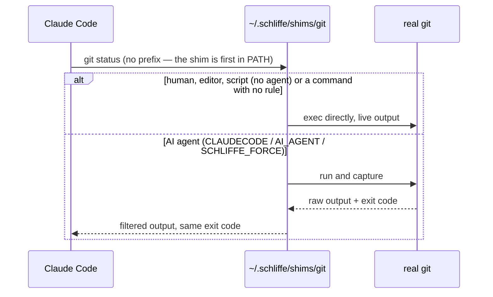

<div align="center">


**Cuts the noise out of what AI coding agents read — command output, MCP results and images — without hiding what matters.**

[](LICENSE)
[](Cargo.toml)
[](https://github.com/mkmuniz/schliffe-tk/actions/workflows/ci.yml)
[](https://github.com/mkmuniz/schliffe-tk/releases/latest)

</div>

---

## What it does

When Claude Code (or another agent) runs `git diff`, `pnpm build` or `cargo test`, it reads the whole output — progress bars, padding, 190 remote branches, one line per passing test. Schliffe sits in between and hands the agent a compact version:

- **Same command, no prefix.** The agent runs `git log`; Schliffe answers. Nothing to configure per project.
- **Only for the model's own commands.** You, your editor, and programs that call `git`/`docker` directly — including the agent's own internals, MCP servers and test runners — get the untouched output.
- **Nothing is lost.** Every cut is marked, and `schliffe show <hash>` returns the original.

```text
$ git log -3                       # as the agent sees it
5fab882a05 2026-09-24 23:31 Mkmuniz — MCP: never compress file reads, recoverable trims, crash handling
e734d79dc1 2026-09-24 23:24 Mkmuniz — Add end-to-end tests against the compiled binary
cd0a83980c 2026-09-24 23:21 Mkmuniz — Layer B: stderr support and first batch of long-tail filters
[+16 lines omitted]
(full output: schliffe show a3b5335212fe6e0a)
```

## Install

One command — downloads the prebuilt binary of the latest release, verifies its SHA-256, and sets everything up (a few seconds, no Rust needed):

```bash
curl -fsSL https://raw.githubusercontent.com/mkmuniz/schliffe-tk/main/install.sh | bash
```

Then open a new terminal (in VS Code: **Reload Window**) and start a new Claude Code session.

It puts the shims first in your `PATH` (bash and zsh), registers the Claude Code hooks, and migrates an old Elagix install if there is one. An archive whose checksum doesn't match the release is never installed. Windows: see [Platforms](#platforms).

<details>
<summary>From a clone / building from source</summary>

```bash
git clone https://github.com/mkmuniz/schliffe-tk.git && cd schliffe-tk
bash install.sh                 # with Rust: builds this checkout; without Rust: installs the latest release
bash install.sh --prebuilt      # download even inside a clone
bash install.sh --from-source   # always build (needs Rust)
```
</details>

## Check it's working

```bash
which git        # → ~/.schliffe/shims/git
schliffe stats   # savings so far
```

```text
             commands filtered     before      after  saved ~tokens saved
last 24h          103       32    97.8 KB    49.4 KB   -50%         12.4k

top savings (all time):
  git diff                     4×     65.5 KB →    25.6 KB   -61%
  git log                     12×      8.4 KB →     3.9 KB   -54%

passed through with no filter (candidates for a new rule):
  git status 14×, git commit 11×, git add 10×, ...
```

`stats` logs only command names and sizes (`~/.schliffe/stats.log`) — never arguments or output.

### Where the rest of the tokens go

`stats` only sees what passes through Schliffe. `schliffe report [--days N]` (default 7) reads Claude Code's own transcripts — read-only, nothing leaves the machine — and shows the whole bill:

```text
where the cost is
  re-reading the conversation (cache)      108.6M   71%
  new content entering it                   27.3M   18%
  the model's replies                       10.5M  6.9%
  the model's thinking                       5.6M  3.7%

sessions that cost the most
  fleury-grupo-fleury              903 replies  peak context   967k     48.0M   32%
  acs-frontend                     483 replies  peak context   807k     29.5M   19%

what fills the conversations (tokens added; each is then re-read every reply)
  model replies                              2.1M   65%
  shell commands (Bash)                      573k   18%
  MCP: figma                                 144k  4.4%

schliffe cut ~191k tokens of command/MCP/image output (19% of what that output would have been) — 0.1% of the total cost directly
```

Costs are weighted by relative price (cache re-read 0.1×, new input 1.25×, output 5×); images count by billed pixels, not by the size of their base64.

## Results

Measured on real repositories, bytes before → after (tokens ≈ bytes / 4):

| Command | Before → After | Cut |
|---|---|---|
| `cargo test` (2 suites, all passing) | 7,818 → 124 B | −98% |
| `git pull` (26 files) | 2,467 → 151 B | −94% |
| `git branch -a` (190 remote branches) | 10,258 → 850 B | −92% |
| `git show HEAD` | 10,527 → 1,441 B | −86% |
| `git log -30` | 12,039 → 2,323 B | −81% |
| `docker build` | 1,492 → 292 B | −80% |
| `git diff` (62 files) | 248,098 → 51,234 B | −79% |
| MCP `tools/list` (real server, 14 tools) | 13,018 → 2,940 B | −77% |
| `pnpm build` (Next.js) | 1,070 → 255 B | −76% |
| `git status` | 258 → 62 B | −76% |
| `npm install` | 674 → 166 B | −75% |
| `pnpm lint` (24 problems, all kept) | 3,317 → 2,228 B | −33% |

Across 25 real commands (two production repos, this repo, and build/lint/install/docker projects): **−73% of all bytes, median −74% per command**, with no command left without a rule.

### What to expect overall

In real sessions most tokens are the conversation itself, re-read on every turn — not command output. Measured on a week of use, Schliffe's share of the total bill is **around 1%**. It removes noise; it doesn't make long conversations cheap. The biggest lever there is starting a new session per task.

## What it covers

| Source | Examples | How |
|---|---|---|
| Shell commands | `git`, `cargo`, `pytest`, `docker`, `npm`/`pnpm`/`yarn`, `pip`, `dotnet`, `go`, `terraform` | `$PATH` shim |
| Remote MCP servers | Figma and other HTTP/OAuth servers | Claude Code hook |
| Images | Screenshots from MCP tools, PNG/JPEG opened with Read (resized to 1280px) | Claude Code hook |
| Local MCP servers | Any stdio server you wrap | JSON-RPC proxy |
| Pasted logs | Stack traces (Node/TS, Python, Java, .NET, Go, Rust) and app logs pasted into a prompt | Claude Code hook |
| Long conversations | A one-time notice at 200k / 400k / 600k / 800k tokens of context | Claude Code hook |
| Commit messages | Body of `git log` / `git show` summarized to one sentence | TF-IDF, no model |

Commands without a rule (`ls`, `curl`, `make`...) run untouched, streaming live. For filtered commands, each captured stream has a 64 MiB buffer limit. Above it, the buffered prefix and remaining bytes pass through raw, preserving the exit code; that stream is not compressed or cached.

## Pasted logs and long conversations

Before a prompt reaches the model, Schliffe checks two things (no model involved, nothing added to the conversation):

1. **A big log pasted into the prompt.** It recognizes the kind — stack traces from Node/TypeScript, Python, Java/Kotlin, .NET, Go and Rust, or timestamped app logs — and builds a compact version: every error message and your own code's frames stay; framework frames and routine lines become counted markers; the full log stays recoverable with `schliffe show <hash>`.
   Claude Code doesn't let a hook edit a prompt, so the prompt is held back and **the compact version of your whole prompt is copied to the clipboard** — paste and send. Sending the same prompt again sends the original.
   ```text
   ✂️ Schliffe: .NET stack trace detected (45 → 5 lines, −91%). A compact version of your prompt
   was copied — paste it and send. To send the original, send the same message again.
   ```
2. **A conversation that has grown large.** Every reply re-reads the whole conversation, so past 200k tokens (and again at 400k, 600k, 800k) you get a one-line notice suggesting a new conversation or `/compact`.

Messages follow the language you write in (Portuguese or English). What each kind of log keeps and drops: [`docs/pasted-logs.md`](docs/pasted-logs.md).

## Security

Schliffe sits in front of every command an AI agent runs and stores what those commands printed, so its inputs (command output, MCP results, pasted logs, images) are treated as hostile and its output is assumed to be read by something that acts on it.

- **No network, no telemetry, no scripting, no plugins.** The binary opens no sockets; network-capable and scripting crates are *banned* from the dependency graph by `deny.toml`.
- **Everything it writes is owner-only** (`0600` files, `0700` directories) — the store holds raw command output, which can contain secrets.
- **Audited on every PR and daily**: `cargo audit`, `cargo deny` (advisories, bans, licences, registries), `gitleaks`, and a regression test for each vulnerability ever found.
- **Releases are checksum-verified**; the installer refuses an archive whose SHA-256 doesn't match.

Threat model, the vulnerabilities found and fixed (with how each was exploited), residual risks and how to reproduce the audit: [`SECURITY.md`](SECURITY.md).

## Safety rules

Compression that turns "interrupted" into "success" misleads the agent in later steps ([arXiv 2607.13071](https://arxiv.org/abs/2607.13071)). So:

1. Exit codes are always preserved.
2. No "success" shortcut when the process failed.
3. **Fail-open:** if a filter errors, the raw output goes through.
4. The raw output is always recoverable (`schliffe show <hash>`).
5. Never infer or invent a result — only reformat what came out.
6. Filtered output is never larger than the original.
7. Uses the caller's own `PATH` — never resolves binaries on its own.

Details and the evidence behind each rule: [`specs.md`](specs.md) §4.

## Configuration

| Variable | Effect |
|---|---|
| `SCHLIFFE_DISABLE=1` | Turn filtering off (e.g. `SCHLIFFE_DISABLE=1 git diff > x.patch`) |
| `SCHLIFFE_FORCE=1` | Filter even without an agent marker or a shell parent |
| `SCHLIFFE_NO_STATS=1` | Don't record `stats` |
| `SCHLIFFE_IMAGE_MAX_EDGE` | Image size cap in px (default `1280`, `0` = off) |
| `SCHLIFFE_MCP_RAW_TOOLS=a,b` | MCP tools never to compress |
| `SCHLIFFE_FILTERS_DIR` | Extra TOML rules (default `~/.schliffe/filters`) |
| `SCHLIFFE_PROMPT_LOGS` | Pasted logs: `block` (default, copy compact version), `tip` (just a hint), `off` |
| `SCHLIFFE_CONTEXT_WARN_AT` | Context notice thresholds in tokens (default `200000,400000,600000,800000`, `0` = off) |
| `SCHLIFFE_NO_HOOK=1` | `install.sh`: skip the Claude Code hooks |
| `SCHLIFFE_ALLOW_RELATIVE_PATH=1` | Allow relative `$PATH` entries when resolving the real binary (off by default: an untrusted repo could ship its own `git`) |

Commands: `schliffe stats` · `schliffe show <hash>` · `schliffe hook install|uninstall` · `schliffe mcp` · `schliffe compress` · `schliffe store gc|clear` · `schliffe --version`.

## Platforms

| | Shim | Claude Code hook |
|---|---|---|
| macOS | ✅ validated (zsh) | ✅ validated |
| Linux / WSL | ✅ validated (bash) | ✅ |
| Windows (native) | ⚠️ `install.ps1` (`irm https://raw.githubusercontent.com/mkmuniz/schliffe-tk/main/install.ps1 \| iex`), install tested on CI; filtering not validated on a real machine | ❌ Claude Code ignores hook output replacement there |

Prebuilt binaries for all four targets are attached to each [release](https://github.com/mkmuniz/schliffe-tk/releases/latest).

## Local MCP servers

Wrap a stdio server by putting `schliffe mcp --keep-schemas --` in front of its command:

```bash
claude mcp add filesystem -- schliffe mcp --keep-schemas -- npx -y @modelcontextprotocol/server-filesystem ~/projects
```

- `--keep-schemas` leaves the tool list untouched (recommended for Claude Code, which already loads schemas on demand). Without it, `tools/list` is shrunk and a `get_tool_schema` tool is added.
- Only JSON results are compressed. Tools that read files (`read`, `file`, `cat`, `open`, `download`...) are never touched.
- If the server disconnects mid-call, pending requests get an error instead of waiting for the process to exit.
- Each MCP message is limited to 64 MiB in either direction; oversized messages close the connection. Sessions can exceed 64 MiB in total, and valid tool calls have no execution timeout.

Remote servers (like Figma) don't need this — the hook covers them.

### Remote MCP servers (HTTP)

The same proxy can connect to a remote Streamable HTTP server. The local
stdio mode above remains available:

```bash
schliffe mcp --url https://mcp.example.com/mcp \\
  --header 'Authorization=Bearer ${MCP_TOKEN}'
```

The URL mode reuses schema lazy-loading, result compression, recovery storage,
and the 64 MiB response limit. Header values may reference an environment
variable with `${NAME}`; Schliffe does not print the resolved value. OAuth
browser login and token storage are planned for the next stage. Until then,
use a short-lived token through an environment variable.

## How it works



- **Layer A** — hand-written parsers for the heavy hitters: `git status/log/diff/show/pull/branch`, `cargo test`, `pytest`, `docker images/ps`.
- **Layer B** — declarative TOML rules for the long tail (installs, builds, linters, docker, dotnet, go…), extensible without recompiling.
- **Store** — keeps raw outputs for `schliffe show`, caches `git show <sha>`, and collapses an identical output repeated in the same agent session.
- **Hook** — a Claude Code `PostToolUse` hook rewrites remote MCP results and oversized images before the model sees them.

## Project layout

```
src/
  main.rs          # meta-command (`schliffe ...`) vs shim (`git`, `npm`...)
  core/            # store (recovery, cache, dedup), stats, meta-commands
  bornes/
    comandos/      # $PATH shim — Layer A parsers + Layer B TOML rules
    hook/          # Claude Code PostToolUse hook — remote MCP + images
    prompt/        # Claude Code UserPromptSubmit hook — pasted logs, context notices
    mcp/           # stdio JSON-RPC proxy for local MCP servers
    prosa/         # TF-IDF commit-message summaries
tests/e2e.rs       # end-to-end tests against the compiled binary
```

## Background

Schliffe exists because the hook-based way of doing this — having Claude Code rewrite each command through `PreToolUse.updatedInput` — is [silently ignored on Windows](https://github.com/anthropics/claude-code/issues/79321). So Schliffe intercepts from the outside — a `$PATH` shim, like `nvm` or `pyenv` — and only uses a hook where nothing else can reach (remote MCP, images). It was called **Elagix** until v0.3.0; *Schliffe* is German for the cuts of a gem.

## Documentation

- [`specs.md`](specs.md) — architecture, rules, and the audit behind the design.
- [`KNOWN_ISSUES.md`](KNOWN_ISSUES.md) — gaps and limitations, with the reasons.
- [`TASKS.md`](TASKS.md) — backlog.
- [`MILESTONES.md`](MILESTONES.md) — development history and live validations.
- [`SECURITY.md`](SECURITY.md) — threat model, fixed vulnerabilities, residual risks, disclosure.
- [`CHANGELOG.md`](CHANGELOG.md) — release notes.

Contributing: [`CONTRIBUTING.md`](CONTRIBUTING.md) · License: [Apache 2.0](LICENSE).
